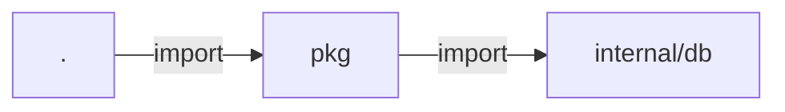

# visualize-graph

facts を Mermaid または DOT 形式のグラフとしてレンダリングする。

---

## 概要

`cache/facts/` 配下に格納された依存関係（deps）またはコール関係（call_edges）を可視化用テキストに変換する。GitHub の PR コメントに直接埋め込めるよう Mermaid をデフォルトとし、Graphviz `dot` 等で処理するための DOT 形式も選択可能。

## API

```typescript
import { visualizeGraph } from "./skills/visualize.ts";

const result = await visualizeGraph({
  repoRoot: "/path/to/repo",
  cacheDir: "/path/to/cache",  // default: "<repoRoot>/cache"
  kind: "deps",                 // "deps" (default) | "callgraph"
  format: "mermaid",            // "mermaid" (default) | "dot"
  match: ["internal/"],         // optional: 部分一致でノードを絞り込み
  include: ["unit:go:pkg"],     // optional: 完全一致 ID で絞り込み
  maxEdges: 500,                // optional: エッジ数上限（default 500）
});

console.log(result.graph);
```

### VisualizeOptions

| フィールド | 型 | 必須 | 説明 |
|---|---|---|---|
| `repoRoot` | `string` | Yes | リポジトリルートパス |
| `cacheDir` | `string` | No | キャッシュディレクトリ |
| `kind` | `"deps" \| "callgraph"` | No | グラフ種別（default: `"deps"`） |
| `format` | `"mermaid" \| "dot"` | No | 出力形式（default: `"mermaid"`） |
| `include` | `string[]` | No | unit_id/symbol_id の完全一致フィルタ |
| `match` | `string[]` | No | unit_id/symbol_id の部分一致フィルタ |
| `maxEdges` | `number` | No | エッジ数の上限（default: 500） |

### VisualizeResult

| フィールド | 型 | 説明 |
|---|---|---|
| `graph` | `string` | レンダリングされたグラフテキスト |
| `format` | `"mermaid" \| "dot"` | 実際の出力形式 |
| `kind` | `"deps" \| "callgraph"` | 実際のグラフ種別 |
| `nodeCount` | `number` | フィルタ後のノード数 |
| `edgeCount` | `number` | フィルタ後のエッジ数 |
| `truncated` | `boolean` | `maxEdges` でエッジが削られた場合 true |

## グラフ種別

### `kind: "deps"` — Unit 依存グラフ

`facts.deps` を読み込み、unit 単位の依存関係を出力。エッジには `kind`（例: `import`）がラベルとして付く。

### `kind: "callgraph"` — シンボル間コールグラフ

`facts.call_edges` を読み込み、関数間の呼び出し関係を出力。エッジには `dispatch`（`static`/`dynamic`/`interface`）が付く。LSP 未統合の言語ではエッジが生成されないため空グラフになることがある。

## 出力例

Mermaid（deps）:



DOT（callgraph）:

```
digraph G {
  rankdir=LR;
  nsym_..._main [label="main"];
  nsym_..._NewService [label="NewService"];
  nsym_..._main -> nsym_..._NewService [label="static"];
}
```

## 依存

- `core/storage`: facts の読み込み
- `core/schema`: Facts スキーマ

## 実装

### 配置先

- スキル実装: `skills/visualize.ts`
- テスト: `skills/visualize.test.ts`

### 処理

1. `readFactsPartial` で必要なフィールドのみ読み込む（deps なら `units`/`deps`、callgraph なら `symbols`/`call_edges`）。
2. `include` / `match` でエッジをフィルタ。
3. `maxEdges` を超えた時点で打ち切り、`truncated: true` を返す。
4. Mermaid または DOT 形式にレンダリング。ノード ID は `n` + 英数字のみに正規化。

### エラーハンドリング

- `cache/facts/` 不在: `"No cached facts found. Run index-facts first."` をスロー。

## 使用例

```typescript
// PR コメントに貼り付け可能な Mermaid を生成
const { graph } = await visualizeGraph({
  repoRoot: ".",
  match: ["internal/"],
  maxEdges: 100,
});
await Bun.write("deps.mmd", graph);
```
